# AWS CI/CD Pipeline with GitHub Actions, Docker & Amazon ECS Fargate

<p align="center">


</p>

---

# Project Overview

This project demonstrates the implementation of a production-style **Continuous Integration and Continuous Deployment (CI/CD)** pipeline on **Amazon Web Services (AWS)** using modern DevOps practices.

The solution automates the complete software delivery lifecycle by integrating **GitHub Actions**, **Docker**, **Terraform**, **Amazon Elastic Container Registry (ECR)**, and **Amazon Elastic Container Service (ECS) Fargate**. Every code change pushed to the **main** branch automatically triggers a deployment workflow that builds a Docker image, publishes it to Amazon ECR, updates the ECS Task Definition, and deploys the latest application version to Amazon ECS without manual intervention.

Infrastructure is provisioned entirely with **Terraform**, creating a secure AWS environment that includes a Virtual Private Cloud (VPC), public and private subnets, an Internet Gateway, NAT Gateway, Application Load Balancer, Security Groups, CloudWatch monitoring, Amazon SNS notifications, and ECS Service Auto Scaling.

This project demonstrates practical experience with Infrastructure as Code (IaC), containerization, cloud networking, monitoring, automation, and scalable application deployment using AWS services.

---

# Features

* ✅ Infrastructure provisioned using Terraform
* ✅ Dockerized Python Flask application
* ✅ GitHub Actions CI/CD pipeline
* ✅ Amazon ECS Fargate deployment
* ✅ Amazon Elastic Container Registry (ECR)
* ✅ Application Load Balancer
* ✅ Public and Private subnet architecture
* ✅ NAT Gateway
* ✅ CloudWatch Logs
* ✅ CloudWatch Container Insights
* ✅ CloudWatch Alarms
* ✅ Amazon SNS email notifications
* ✅ ECS Service Auto Scaling
* ✅ Deployment Circuit Breaker
* ✅ GitHub Secrets
* ✅ Zero manual deployments

---

# AWS Architecture

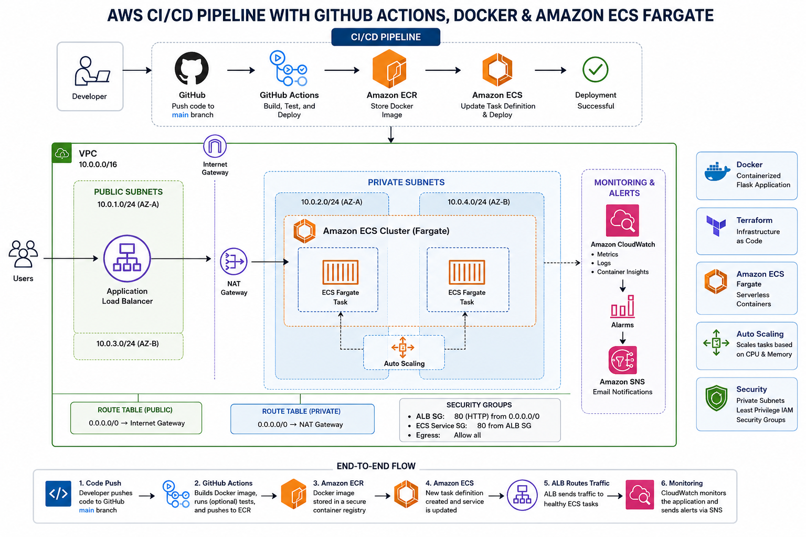

---

# Solution Architecture

The infrastructure follows AWS best practices by separating public-facing resources from private application resources.

The Application Load Balancer is deployed inside public subnets and receives incoming HTTP traffic from users. The load balancer forwards requests to Amazon ECS Fargate tasks running inside private subnets, preventing direct public access to the application containers.

Whenever code is pushed to GitHub, GitHub Actions automatically:

1. Builds a Docker image.
2. Authenticates with Amazon ECR.
3. Pushes the image to the ECR repository.
4. Retrieves the current ECS Task Definition.
5. Updates the container image.
6. Deploys a new ECS task revision.
7. Waits for the ECS service to become healthy.

CloudWatch continuously collects logs and metrics while Amazon SNS sends notifications whenever configured alarms are triggered. ECS Service Auto Scaling automatically adjusts the number of running tasks based on CPU and memory utilization.

---

# Technologies Used

## AWS Services

* Amazon ECS (Fargate)
* Amazon Elastic Container Registry (ECR)
* Amazon VPC
* Public Subnets
* Private Subnets
* Internet Gateway
* NAT Gateway
* Route Tables
* Security Groups
* Application Load Balancer
* Amazon CloudWatch
* CloudWatch Container Insights
* CloudWatch Alarms
* Amazon SNS
* IAM Roles and Policies

## DevOps

* GitHub
* GitHub Actions
* Docker
* Terraform

## Programming

* Python
* Flask

---

# Repository Structure

```text
aws-ecs-cicd-pipeline/
│
├── .github/
│   └── workflows/
│       └── deploy.yml
│
├── app/
│   ├── app.py
│   ├── Dockerfile
│   ├── requirements.txt
│   └── .dockerignore
│
├── infra/
│   ├── provider.tf
│   ├── networking.tf
│   ├── security.tf
│   ├── iam.tf
│   ├── ecr.tf
│   ├── ecs.tf
│   ├── alb.tf
│   ├── autoscaling.tf
│   ├── monitoring.tf
│   ├── outputs.tf
│   ├── variables.tf
│   └── terraform.tfvars
│
├── screenshots/
│   ├── architecture.png
│   ├── github-actions.png
│   ├── ecr.png
│   ├── ecs-cluster.png
│   ├── ecs-service.png
│   ├── ecs-task.png
│   ├── alb.png
│   ├── cloudwatch-dashboard.png
│   ├── cloudwatch-alarm.png
│   ├── sns.png
│   ├── autoscaling.png
│   └── application.png
│
├── README.md
└── .gitignore
```

---

# CI/CD Pipeline Workflow

Every push to the **main** branch automatically starts the deployment pipeline.

```text
Developer
      │
git push origin main
      │
      ▼
GitHub Repository
      │
      ▼
GitHub Actions
      │
      ▼
Build Docker Image
      │
      ▼
Push Image to Amazon ECR
      │
      ▼
Update ECS Task Definition
      │
      ▼
Deploy Amazon ECS Fargate
      │
      ▼
Application Load Balancer
      │
      ▼
Python Flask Application
```

The workflow automatically:

* Checks out the repository
* Configures AWS credentials
* Builds the Docker image
* Pushes the image to Amazon ECR
* Updates the ECS Task Definition
* Deploys a new ECS revision
* Waits until the ECS Service becomes healthy
* Serves the latest application through the Application Load Balancer

# Infrastructure Overview

Terraform provisions the complete AWS infrastructure for this project.

## Networking

* Amazon Virtual Private Cloud (VPC)
* Two Public Subnets
* Two Private Subnets
* Internet Gateway
* NAT Gateway
* Public & Private Route Tables
* Security Groups

## Compute

* Amazon ECS Cluster
* Amazon ECS Service
* Amazon ECS Task Definition
* Amazon ECS Fargate

## Container Registry

* Amazon Elastic Container Registry (ECR)

## Load Balancing

* Application Load Balancer
* Target Group
* Health Checks

## Monitoring

* Amazon CloudWatch
* CloudWatch Logs
* CloudWatch Container Insights
* CloudWatch Alarms
* Amazon SNS Notifications

## Auto Scaling

* ECS Service Auto Scaling
* CPU Target Tracking Policy
* Memory Target Tracking Policy

---

# Security

Security was incorporated into every layer of the solution.

The Application Load Balancer is deployed in public subnets and is the only component exposed to the internet. ECS tasks are deployed inside private subnets and do not receive public IP addresses.

Network traffic is restricted through Security Groups following the principle of least privilege.

GitHub Actions authenticates to AWS using encrypted GitHub Secrets instead of hardcoded credentials.

Security features implemented include:

* Private subnets for ECS tasks
* Public subnets only for the Application Load Balancer
* NAT Gateway for secure outbound internet access
* Security Groups with least-privilege rules
* IAM Roles for ECS Task Execution
* IAM Task Role for ECS containers
* GitHub Secrets
* Deployment Circuit Breaker
* CloudWatch monitoring
* Amazon SNS notifications

---

# Monitoring & Auto Scaling

CloudWatch continuously monitors the ECS cluster and running containers.

Monitoring includes:

* CloudWatch Logs
* CloudWatch Container Insights
* CPU Utilization Metrics
* Memory Utilization Metrics
* CloudWatch Alarms
* Amazon SNS Email Notifications

The ECS Service automatically scales according to workload demand using Target Tracking policies.

Scaling configuration:

* Minimum Tasks: **1**
* Maximum Tasks: **3**
* CPU Target Tracking
* Memory Target Tracking
* Scale-In Cooldown
* Scale-Out Cooldown

This enables the application to maintain performance during increased traffic while optimizing AWS resource usage.

---

# Project Screenshots

## Infrastructure

| AWS Architecture                  | Terraform Deployment                 |
| --------------------------------- | ------------------------------------ |
|  | 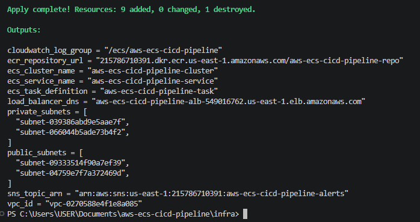 |

---

## CI/CD Pipeline

| GitHub Actions                      | Amazon ECR               |
| ----------------------------------- | ------------------------ |
| 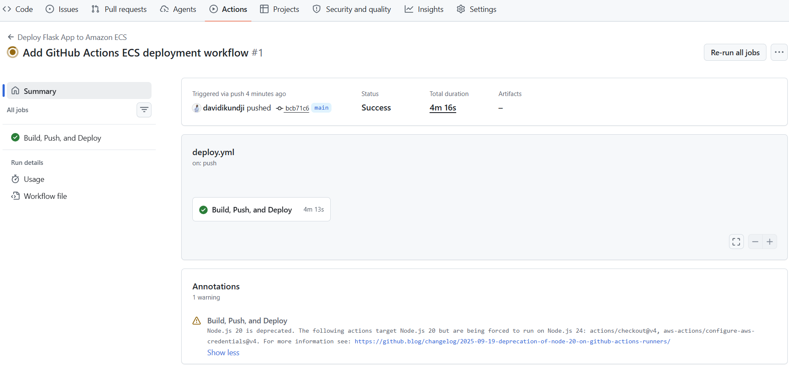 | 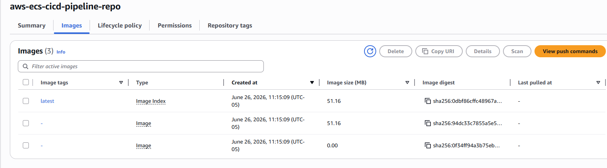 |

---

## Amazon ECS

| ECS Cluster                      | ECS Service                      |
| -------------------------------- | -------------------------------- |
| 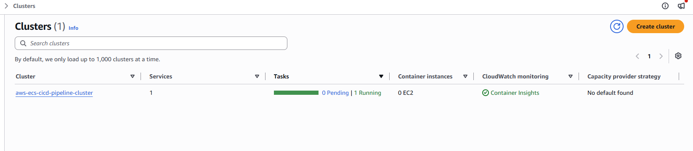 | 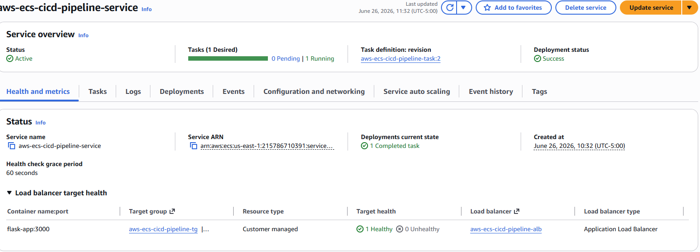 |

| ECS Task                      | ECS Auto Scaling                 |
| ----------------------------- | -------------------------------- |
| 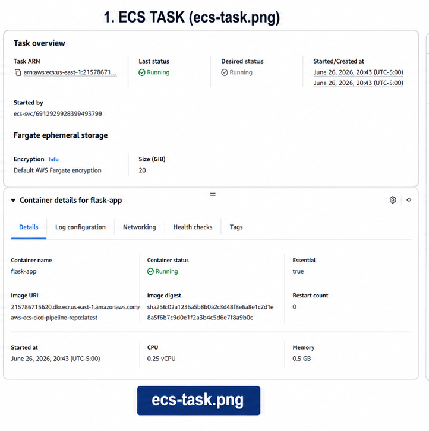 | 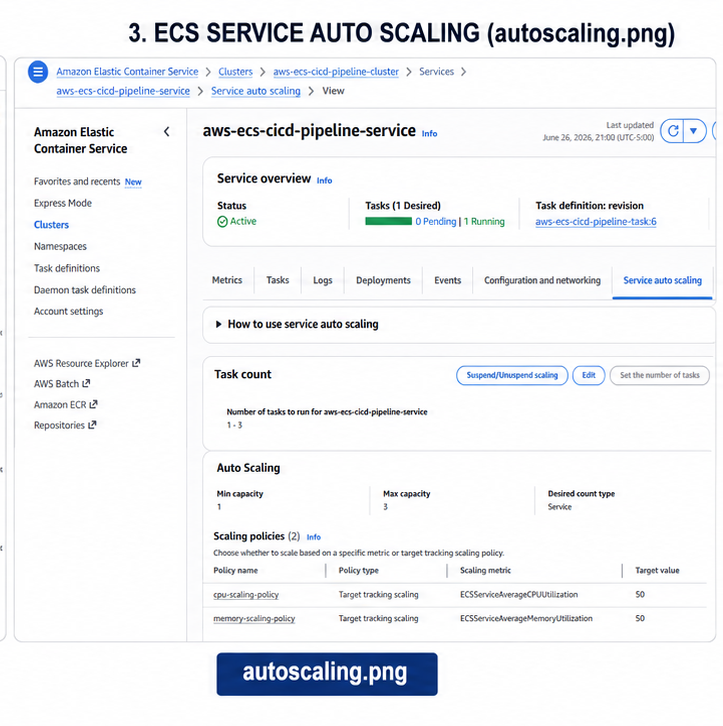 |

---

## Monitoring

| CloudWatch Dashboard                      | CloudWatch Alarms                     |
| ----------------------------------------- | ------------------------------------- |
| 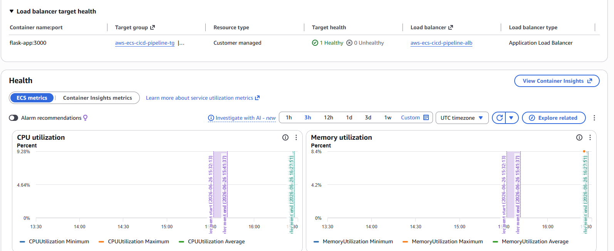 | 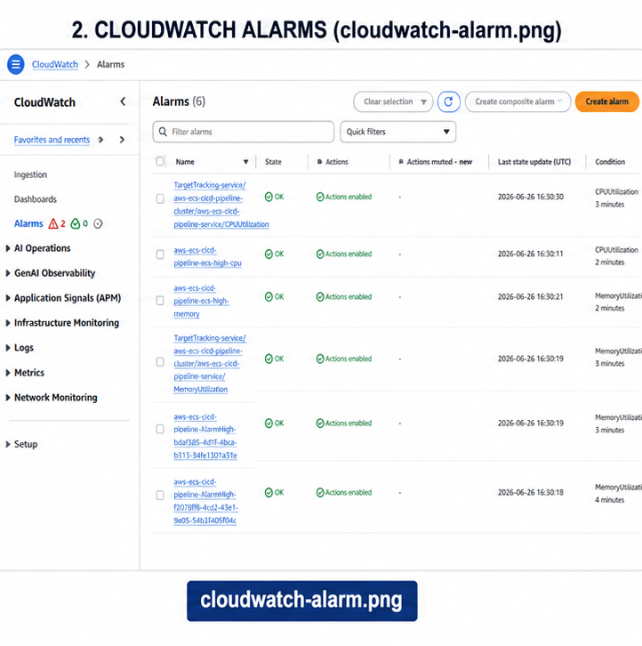 |

| Amazon SNS               |
| ------------------------ |
| 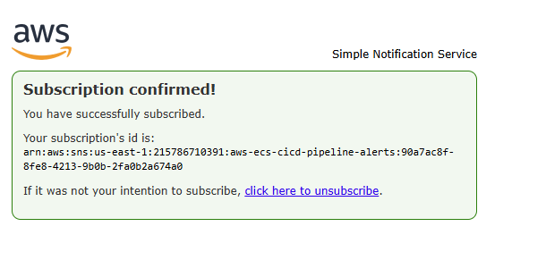 |

---

## Load Balancer & Application

| Application Load Balancer | Running Application              |
| ------------------------- | -------------------------------- |
|   | 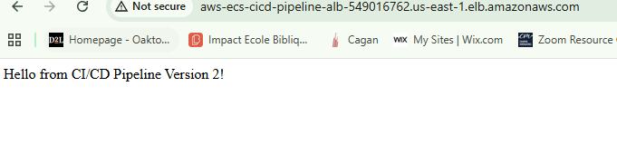 |

---

# Deployment Verification

The CI/CD pipeline was successfully validated by modifying the Flask application message from:

```text
Hello from CI/CD Pipeline!
```

to:

```text
Hello from CI/CD Pipeline Version 2!
```

After pushing the updated code to the **main** branch, GitHub Actions automatically:

* Built a new Docker image
* Pushed the image to Amazon ECR
* Updated the ECS Task Definition
* Deployed a new ECS task revision
* Waited for the ECS Service to stabilize

Refreshing the Application Load Balancer URL confirmed that the updated application was running successfully without any manual deployment steps.

This verified that the end-to-end CI/CD pipeline was functioning as designed.

# Skills Demonstrated

This project demonstrates hands-on experience with a wide range of AWS Cloud Engineering and DevOps technologies.

## Cloud Engineering

* Amazon ECS Fargate
* Amazon Elastic Container Registry (ECR)
* Amazon VPC
* Public and Private Subnets
* Internet Gateway
* NAT Gateway
* Route Tables
* Security Groups
* Application Load Balancer
* Cloud Networking
* High Availability Design

## Infrastructure as Code

* Terraform
* Modular Infrastructure Design
* Resource Dependencies
* Variables and Outputs
* Infrastructure Automation

## DevOps

* GitHub
* GitHub Actions
* Continuous Integration (CI)
* Continuous Deployment (CD)
* Docker
* Container Image Management
* Deployment Automation

## Monitoring

* Amazon CloudWatch
* CloudWatch Logs
* CloudWatch Container Insights
* CloudWatch Alarms
* Amazon SNS Notifications

## Security

* IAM Roles
* IAM Policies
* GitHub Secrets
* Principle of Least Privilege
* Secure Private Networking

## Programming

* Python
* Flask

---

# Lessons Learned

This project provided valuable hands-on experience designing, automating, and deploying a modern cloud-native application using AWS services and DevOps practices.

One of the biggest lessons was understanding how Infrastructure as Code simplifies cloud deployments. By provisioning the complete environment with Terraform, every AWS resource could be recreated consistently and reliably without manual configuration.

Implementing Docker demonstrated the value of containerization by ensuring the application behaved consistently across development and production environments.

Building the CI/CD pipeline with GitHub Actions reinforced how deployment automation improves software delivery. Every code change automatically triggered a workflow that built a Docker image, pushed it to Amazon ECR, updated the ECS task definition, and deployed the latest application version without manual intervention.

Configuring CloudWatch monitoring, Amazon SNS notifications, ECS Auto Scaling, and deployment circuit breakers highlighted the importance of observability, resiliency, and operational excellence when designing production-ready cloud applications.

Overall, this project strengthened my understanding of cloud architecture, Infrastructure as Code, DevOps automation, AWS networking, container orchestration, and scalable application deployment.

---

# Challenges Encountered

During the implementation of this project, several technical challenges were encountered and successfully resolved.

### Configuring IAM Roles

Understanding the difference between the ECS Task Execution Role and the ECS Task Role required careful troubleshooting. Correctly assigning permissions was essential for pulling Docker images from Amazon ECR, writing logs to CloudWatch, and enabling ECS Exec functionality.

### Amazon ECR Authentication

Authenticating Docker with Amazon ECR initially resulted in login failures. The issue was resolved by verifying the AWS CLI configuration, confirming the ECR repository URI, refreshing the authorization token, and successfully authenticating Docker before pushing container images.

### ECS Networking

Deploying Amazon ECS Fargate tasks in private subnets required correctly configuring the NAT Gateway, route tables, security groups, and the Application Load Balancer. This improved my understanding of secure cloud networking and how AWS services communicate within a VPC.

### GitHub Actions Automation

Designing the deployment workflow required integrating GitHub Secrets, building Docker images, pushing them to Amazon ECR, updating the ECS task definition, and waiting for the ECS service to stabilize. Successfully automating these steps provided practical experience implementing production-style CI/CD pipelines.

Each challenge strengthened my troubleshooting skills while improving my understanding of AWS architecture and DevOps automation.

---

# Future Improvements

Although the solution is fully functional, several enhancements could further improve its security, scalability, and operational maturity.

Potential future improvements include:

* Implement Blue/Green deployments.
* Add Canary deployment strategies.
* Store application secrets in AWS Secrets Manager.
* Configure HTTPS using AWS Certificate Manager (ACM).
* Register a custom domain with Amazon Route 53.
* Protect the application using AWS WAF.
* Add distributed tracing with AWS X-Ray.
* Store Terraform remote state in Amazon S3 with DynamoDB state locking.
* Integrate automated unit and integration testing before deployment.
* Add Docker image vulnerability scanning.
* Build CloudWatch dashboards for operational reporting.
* Implement cost monitoring using AWS Cost Explorer.

---

# Project Outcome

The completed solution delivers a fully automated cloud-native deployment platform built using AWS services and modern DevOps practices.

Every push to the **main** branch automatically triggers GitHub Actions to:

* Build a new Docker image.
* Push the image to Amazon Elastic Container Registry.
* Update the ECS Task Definition.
* Deploy the latest application version to Amazon ECS Fargate.
* Wait for the deployment to complete successfully.
* Serve the updated application through the Application Load Balancer.

The deployment pipeline was successfully validated by modifying the Flask application and confirming that the updated version was automatically deployed without any manual AWS operations.

The final solution provides:

* Fully automated CI/CD
* Infrastructure as Code
* Secure networking
* High availability
* Container orchestration
* Monitoring and alerting
* Automatic scaling
* Production-style deployment automation

---

# Conclusion

This project demonstrates the successful implementation of a production-ready Continuous Integration and Continuous Deployment pipeline using GitHub Actions, Docker, Terraform, Amazon Elastic Container Registry (ECR), and Amazon ECS Fargate.

By combining Infrastructure as Code, containerization, automated deployments, secure networking, cloud monitoring, and Auto Scaling, the solution delivers a scalable, resilient, and repeatable deployment platform that follows modern AWS and DevOps best practices.

Throughout this project, I gained practical experience provisioning AWS infrastructure, designing secure cloud architectures, automating application deployments, implementing monitoring and alerting, and troubleshooting real-world cloud engineering challenges.

This project represents a comprehensive demonstration of AWS Cloud Engineering and DevOps skills and serves as a strong portfolio project showcasing hands-on experience with modern cloud-native application deployment.

---

# Author

## David Ikundji

**AWS Cloud Engineer | M.Sc. Computer Science (AI & Machine Learning) | DevOps En

### Connect with Me

* **GitHub:** https://github.com/davidikundji
* **LinkedIn:** https://www.linkedin.com/in/david-ikundji-5b6473213/

---


